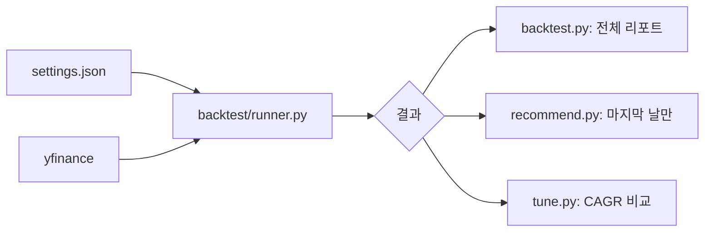

# 시스템 아키텍처 (System Architecture)

## 1. 프로젝트 개요
이 프로젝트는 **나스닥 레버리지 스위칭 전략**을 자동으로 최적화하고 매매 추천을 생성하는 시스템입니다.
핵심 구성요소:
- **튜닝(Tuning)**: 과거 데이터를 기반으로 최적의 파라미터를 탐색
- **백테스트(Backtest)**: 전략의 과거 성과를 검증
- **추천(Recommendation)**: 백테스트 결과를 바탕으로 현재 포지션 결정

## 2. 파일 구조

```
📁 nasdaq-leverage-switching/
├── 📄 tune.py              # 튜닝 실행 진입점
├── 📄 backtest.py          # 백테스트 실행 진입점
├── 📄 recommend.py         # 추천 실행 진입점 (백테스트 결과 활용)
├── 📄 settings.json        # 파라미터 설정 파일
├── 📁 logic/
│   ├── 📁 backtest/        # 백테스트 핵심 로직
│   │   ├── runner.py       # 백테스트 엔진
│   │   ├── data.py         # 데이터 다운로드/전처리
│   │   ├── signals.py      # 시그널 계산 및 포지션 결정
│   │   └── settings.py     # 설정 로딩
│   └── 📁 tune/            # 튜닝 로직
│       └── runner.py       # 병렬 튜닝 실행
├── 📁 docs/                # 문서
├── 📁 zresults/            # 실행 결과 로그 저장
└── 📁 znotes/              # 사용자 메모
```

## 3. 모듈 역할

### 진입점 스크립트
| 파일 | 역할 |
|------|------|
| `tune.py` | 파라미터 최적화 실행. 결과를 `settings.json`에 저장 |
| `backtest.py` | 전략 성과 검증. 상세 리포트 출력 |
| `recommend.py` | **백테스트 결과의 마지막 날**을 오늘의 추천으로 출력 |

### 핵심 로직 (`logic/backtest/`)
모든 비즈니스 로직이 `logic/backtest/` 폴더에 통합되어 있습니다.

| 파일 | 역할 |
|------|------|
| `runner.py` | 백테스트 엔진 (일별 손익, CAGR, MDD 계산) |
| `data.py` | yfinance를 통한 주가/환율 다운로드 |
| `signals.py` | Drawdown 계산 및 `pick_target()` 함수 |
| `settings.py` | `settings.json` 로딩 및 검증 |

> **설계 원칙**: `recommend.py`는 독립적인 추천 로직 없이, `backtest.py`와 동일한 로직을 사용합니다.
> 백테스트의 마지막 날 결과가 곧 "오늘의 추천"이 됩니다.

## 4. 데이터 흐름



1. **설정 로드**: `settings.json`에서 파라미터 읽기
2. **데이터 수집**: yfinance로 QQQ, TQQQ, 방어자산 주가 다운로드
3. **백테스트 실행**: 일별 포지션 및 손익 계산
4. **결과 출력**:
   - `backtest.py`: 전체 기간 리포트
   - `recommend.py`: 마지막 날 포지션만 추출
   - `tune.py`: 여러 파라미터 조합의 CAGR 비교
