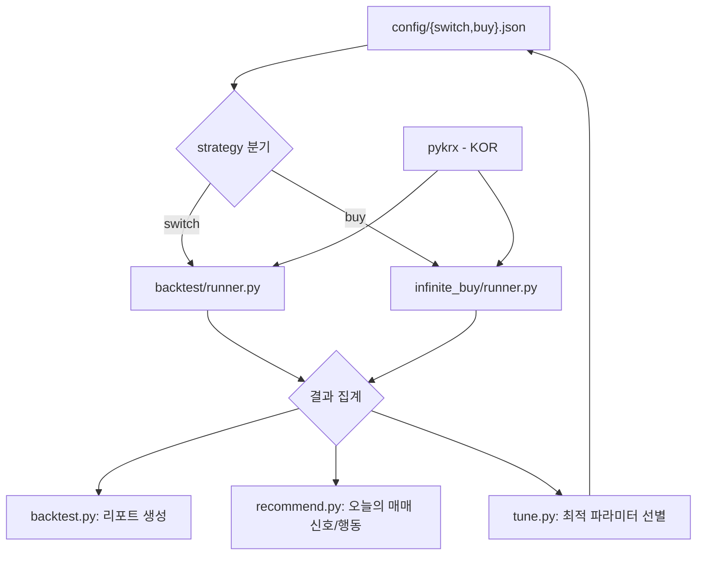

# 시스템 아키텍처 (System Architecture)

## 1. 프로젝트 개요
이 프로젝트는 한국 레버리지 ETF에 대해 두 전략(`switch` 스위칭 / `buy` 무한매수법)을 운용하며,
파라미터를 (로컬에서 수동) 튜닝하고 매매 추천을 자동 생성하는 시스템입니다.
모든 진입점은 전략 프로파일 인자(`switch`/`buy`)를 받고, 시장은 `config/{profile}.json`의 `market` 필드로 결정됩니다.
핵심 구성요소:
- **튜닝(Tuning)**: 과거 데이터를 기반으로 최적의 파라미터를 탐색
- **백테스트(Backtest)**: 전략의 과거 성과를 검증
- **추천(Recommendation)**: 백테스트 결과를 바탕으로 현재 포지션/행동 결정

## 2. 파일 구조

```
📁 leverage-switching/
├── 📄 tune.py              # 튜닝 실행 진입점 (전략 프로파일 인자: switch/buy)
├── 📄 backtest.py          # 백테스트 실행 진입점
├── 📄 recommend.py         # 추천 실행 진입점
├── 📁 config/              # 전략 프로파일별 설정 파일 저장소
│   ├── 📄 switch.json      # 스위칭 전략 설정 (market=kor)
│   └── 📄 buy.json         # 무한매수법 설정 (market=kor)
├── 📁 logic/
│   ├── 📁 backtest/        # 스위칭 백테스트 핵심 로직
│   │   ├── runner.py       # 스위칭 백테스트 엔진
│   │   ├── data.py         # 데이터 다운로드 (yfinance/pykrx)
│   │   ├── signals.py      # 시그널 계산 및 포지션 결정
│   │   └── settings.py     # 전략별 설정 로딩 및 포맷 정규화
│   ├── 📁 tune/            # 스위칭 튜닝 로직
│   │   └── runner.py       # 병렬 튜닝 및 데이터 가용성 체크
│   └── 📁 infinite_buy/    # 무한매수법 엔진
│       └── runner.py       # 시뮬레이션·백테스트·튜닝·추천
├── 📁 utils/
│   ├── 📄 slack.py         # Slack SDK 연동 알림 모듈
│   └── 📄 logger.py        # 전역 로깅 및 버전 관리
├── 📁 .github/workflows/
│   └── 📄 deploy.yml       # upgrade 브랜치 푸시 시 Oracle VM 배포 + crontab 반영
├── 📁 infra/cron/
│   ├── 📄 crontab          # 한국 거래일 하루 3회 스케줄 (switch/buy)
│   ├── 📄 install.sh       # 마커 기반 idempotent crontab 병합 설치
│   └── 📄 run_batch.py     # 배치 래퍼 (로그/락/Slack 시작·실패 알림)
├── 📁 zresults/            # 실행 결과 저장소
│   ├── 📁 switch/          # 스위칭 전략 로그
│   └── 📁 buy/             # 무한매수법 로그
```

## 3. 모듈 역할

### 진입점 스크립트
| 파일 | 역할 |
|------|------|
| `tune.py` | 파라미터 최적화 실행. 결과를 `config/*.json`에 업데이트하고 `--slack` 사용 시 튜닝 결과 전송 |
| `backtest.py` | 전략 성과 검증. 상세 리포트 및 로그 생성 |
| `recommend.py` | 최근 데이터를 바탕으로 오늘의 포지션 추천 |

### 핵심 로직 (`logic/`)
| 파일 | 역할 |
|------|------|
| `backtest/runner.py` | 스위칭(switch) 백테스트 엔진 |
| `backtest/data.py` | `pykrx`(한국)·`yfinance`(미국)를 통한 데이터 수집 (market 필드로 분기) |
| `backtest/signals.py` | 기초 지수(KODEX 코스피 등) 기반 드로다운 계산 |
| `backtest/settings.py` | 전략(switch/buy)별 설정 검증·정규화 |
| `tune/runner.py` | 스위칭 전수 탐색 튜닝 및 데이터 가용성 체크 |
| `infinite_buy/runner.py` | 무한매수법(buy) 시뮬레이션·백테스트·튜닝·추천 빌더 |

### 유틸리티 (`utils/`)
| 파일 | 역할 |
|------|------|
| `slack.py` | `slack-sdk`를 이용한 Block Kit 기반 알림 전송 |
| `logger.py` | `APP_VERSION` 관리 및 실행 로그 기록 |

## 4. 데이터 흐름


```mermaid
graph TD
    A["config/{switch,buy}.json"] --> B{strategy 분기}
    B -->|switch| S[backtest/runner.py]
    B -->|buy| K[infinite_buy/runner.py]
    C2[pykrx - KOR] --> S
    C2 --> K
    S --> D{결과 집계}
    K --> D
    D --> E[backtest.py: 리포트 생성]
    D --> F[recommend.py: 오늘의 매매 신호/행동]
    D --> G[tune.py: 최적 파라미터 선별]
    G --> A
```

1. **설정 로드**: `config/{profile}.json`에서 전략·시장 파라미터 읽기 (`strategy` 필드로 엔진 분기)
2. **데이터 수집**: `market` 필드에 따라 `pykrx`(한국)/`yfinance`(미국)로 주가 다운로드
3. **시뮬레이션 실행**: 일별 포지션·손익 계산 (switch=스위칭, buy=분할매수/익절 사이클)
4. **결과 출력**:
   - `backtest.py`: 전체 기간 리포트 생성
   - `recommend.py`: 최근일 기준 매매 포지션/행동 추천
   - `tune.py`: 모든 조합 비교 후 최적 파라미터를 `config/{profile}.json`에 업데이트
